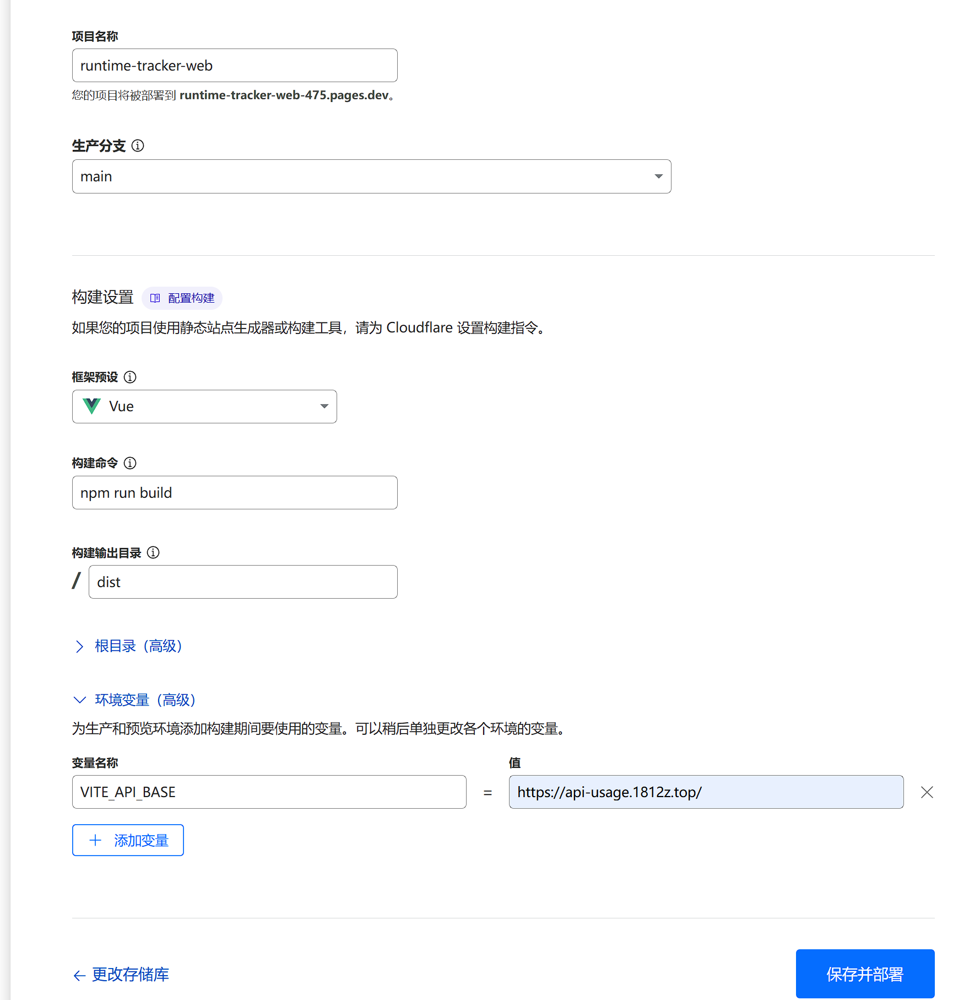

# RunTimer_Tacker 前端项目
## 1.请先配置后端项目 [RunTime_Tacker](https://github.com/1812z/RunTime_Tracker)
## 2.部署
### 方法一 Cloudflare部署 利用Cloudflare Pages快速部署
1. 点击该仓库右上角的fork按钮，创建自己的仓库  
2. 登录Cloudflare，创建一个Pages项目，选择`导入现有 Git 存储库`，连接自建的Github账户  
3. 选择自己仓库，选择master分支，使用环境变量，创建`VITE_API_BASE`,输入自己的后端地址  
4. 完成部署，继续配置域名  

### 方法二 自建服务器
1. 下载项目，配置Nodejs22
2. 修改配置文件，路径: `config.js` ，将api地址改为后端地址（注意保留`/api`）  
3. 运行下述命令构建项目，生成的/dist文件夹下即为静态文件

```bash
npm install
npm run build
```

4. 发布网站到静态服务器

### 3.后续更新
CF Pages会自动同步你的仓库的更新，只需要到仓库点击sync即可  
如果自建服务器，则需要手动构建同步  
